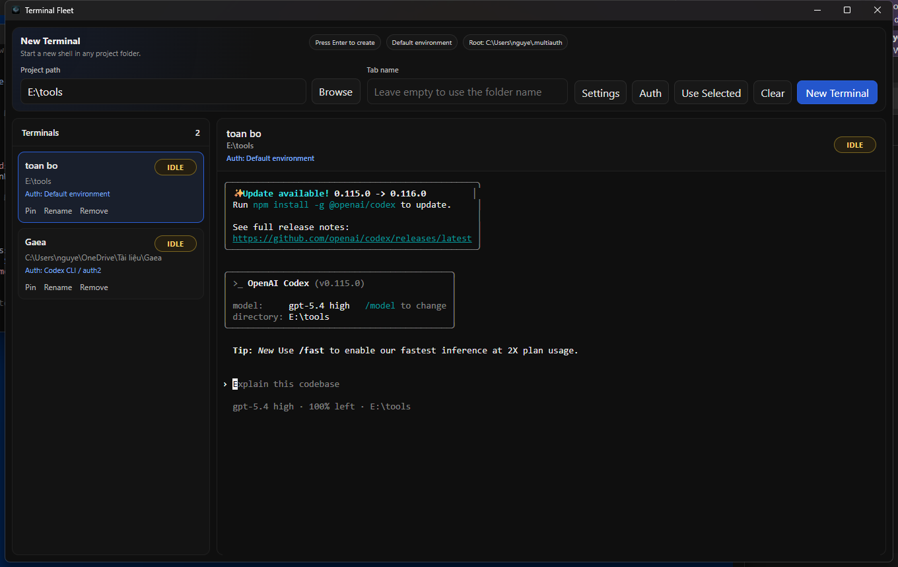

<div align="center">

# Terminal Fleet

### A Windows-first terminal workspace for multi-project AI coding sessions

Run multiple embedded terminals, keep project tabs persistent, and attach the right CLI identity to the right tab without turning your desktop into terminal chaos.

[](#-requirements)
[](#-stack)
[](#-stack)
[](#-stack)
[](./LICENSE)

[Overview](#-overview) |
[Highlights](#-highlights) |
[Supported CLI Auth](#-supported-cli-auth-isolation) |
[Getting Started](#-getting-started) |
[Packaging](#-package-for-windows) |
[Architecture](#-architecture) |
[License](#-license)



</div>

---

## Overview

Terminal Fleet is a focused desktop terminal manager for developers who work across:

- multiple repositories
- multiple AI coding sessions
- multiple CLI identities
- multiple client or workspace contexts

Instead of juggling separate terminal windows and remembering which account each tool is using, Terminal Fleet gives you a single desktop surface where every tab can carry:

- its own working directory
- its own display name
- its own pinned state
- its own CLI auth profile for supported tools

The current build is optimized for **Windows-first local workflows** and uses an embedded terminal stack that is actually suited to terminal-heavy use cases: **Electron + xterm + node-pty**.

## Highlights

<table>
  <tr>
    <td width="33%">
      <strong>Embedded terminal tabs</strong><br/>
      Keep multiple live shells inside one desktop window without bouncing between standalone terminal instances.
    </td>
    <td width="33%">
      <strong>Identity-aware launch</strong><br/>
      Bind a tab to a supported CLI auth profile so the right account follows the right project.
    </td>
    <td width="33%">
      <strong>Persistent workspace</strong><br/>
      Restore saved tabs on next launch with names, paths, pin state, and auth bindings intact.
    </td>
  </tr>
  <tr>
    <td width="33%">
      <strong>Fast operator workflow</strong><br/>
      Pin, rename, reopen, remove, and scan terminal state quickly from one list.
    </td>
    <td width="33%">
      <strong>Local-first by design</strong><br/>
      No hosted backend, no remote relay, no hidden account proxy layer.
    </td>
    <td width="33%">
      <strong>Built for AI coding CLIs</strong><br/>
      Designed around the reality of running Codex, Kimi, and other CLI tools side by side.
    </td>
  </tr>
</table>

## Why it matters

The normal workflow breaks down fast when you are doing serious AI-assisted development:

- one terminal is in the wrong repo
- one CLI is logged into the wrong account
- one experiment pollutes another profile
- one client session stomps your personal setup

Terminal Fleet solves the practical part of that problem:

- keep each terminal attached to a project
- keep supported CLI auth isolated
- make context switching cheap
- make the current session layout visible at a glance

## Supported CLI Auth Isolation

Terminal Fleet currently supports verified auth isolation for:

- **Codex CLI** via `CODEX_HOME`
- **Kimi CLI** via `KIMI_SHARE_DIR`

The app reads and reuses local profile directories in the same multiauth-style layout:

```text
~/.multiauth/codex-cli/<profile>/data
~/.multiauth/kimi-cli/<profile>/data
```

That means if you already created profiles elsewhere, Terminal Fleet can use them immediately instead of forcing a second profile system.

## Why people can trust it

Terminal Fleet is intentionally conservative about identity handling.

### What it does

- launches local shells on your machine
- injects env overrides only for the specific tab that needs them
- keeps profile data in inspectable local folders
- lets you reuse profile storage you already control

### What it does not do

- upload your terminal traffic to a hosted backend
- proxy your CLI auth through a cloud service
- pretend unsupported tools are safely isolated
- hide profile state behind opaque infrastructure

If a CLI does not expose a clean isolation boundary, it should not be marketed as isolated until that boundary is verified.

## Core Workflows

### 1. Open a standard project tab

1. Select a project path.
2. Optionally give the tab a custom name.
3. Leave auth on the default environment.
4. Create the terminal and work normally.

### 2. Open an isolated AI CLI tab

1. Select a project path.
2. Open the `Auth` menu.
3. Pick a supported CLI.
4. Select an existing profile or create a new one.
5. Create the tab.
6. Run the CLI inside that terminal.

### 3. Reuse existing local profiles

If you already manage isolated CLI identities with another local profile launcher, Terminal Fleet can reuse the same profile directories for supported tools.

## Feature Set

### Terminal Management

- Multiple live embedded terminal tabs
- Persistent tab restore on relaunch
- Rename with keyboard or context menu
- Pin important tabs to the top
- Reopen closed terminals without recreating the tab
- Remove tabs cleanly when a workspace is no longer needed

### Session Visibility

- Sidebar scan view for all terminals
- `running`, `idle`, and `closed` status badges
- Active workspace header with cwd and auth context
- Clear distinction between project path, tab label, and auth binding

### Auth-Aware Operations

- Per-tab CLI auth tool selection
- Per-tab profile selection
- In-app create and delete flows for supported CLI profiles
- Reuse of local auth storage from `.multiauth`
- Configurable auth root in Settings when your shared profile store lives elsewhere

## Product Principles

- **Local-first**: no backend required
- **Operationally clear**: current context should be visible fast
- **Pragmatic**: support only what can be isolated reliably
- **Windows-first**: optimize for the platform actually being used

## Architecture

| Path | Responsibility |
| --- | --- |
| `electron/main.ts` | Electron main process, PTY orchestration, persistence, status handling, auth profile routing |
| `electron/preload.ts` | Safe IPC bridge between Electron and the renderer |
| `src/main.tsx` | App shell, terminal tabs, launch flow, auth menu, profile management UI |
| `src/styles.css` | Desktop layout, interaction styling, responsive adjustments |
| `assets/` | Branding assets and app icon |

## Stack

- Electron
- React
- xterm
- node-pty
- esbuild

This is the same class of terminal stack used by serious desktop developer tools and is far better suited to embedded terminals than a thin webview wrapper.

## Getting Started

### Requirements

- Windows 10 or Windows 11
- Node.js 18+
- npm

### Install dependencies

```bash
npm install
```

### Start in development

```bash
npm start
```

### Build the app

```bash
npm run build
```

## Package for Windows

```bash
npm run package:exe
```

The packaged desktop app is written to:

```text
release-packager/Terminal Fleet-win32-x64/
```

Main executable:

```text
release-packager/Terminal Fleet-win32-x64/Terminal Fleet.exe
```

## Repository Layout

```text
electron-terminal-smoke/
├─ assets/
├─ electron/
├─ src/
├─ dist/
├─ dist-electron/
├─ package.json
└─ index.html
```

## Current Limitations

- Windows-first packaging and workflow assumptions
- Auth isolation currently implemented only for verified CLI adapters
- Status tracking is intentionally heuristic-based, not deep process introspection
- Some AI CLIs still need adapter-specific validation before they should be exposed as isolated options

## Roadmap

- More verified CLI adapters
- Better release packaging and distribution
- Quick-launch actions for supported AI CLIs
- Better profile diagnostics and import flows
- More polished onboarding for first-time users

## Development Notes

This project favors reliability over fake abstraction.

If a workflow can be made robust with a direct local mechanism, Terminal Fleet uses it. If a tool does not expose a trustworthy identity boundary, the project should say that clearly instead of shipping a misleading checkbox.

## License

Released under the **MIT License**. See [LICENSE](./LICENSE).
